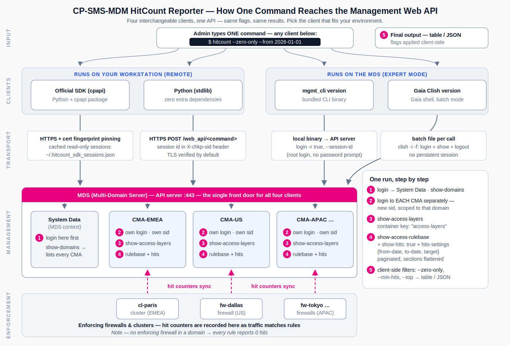

# MDM CMA HitCount Reporter

[](LICENSE)

[](python/hitcount.py)
[](mgmt_cli/hitcount.sh)
[](https://github.com/CheckPointSW/cp_mgmt_api_python_sdk)
[](tests/)

**Report per-rule Access Policy hit counts across every Domain (CMA)** of a
Check Point **Multi-Domain Management (MDM/MDS)** server — from a single
command. The classic use case: `--zero-only` lists every rule that took **no
hits** in the time window, i.e. your rulebase-cleanup candidates, across all
domains at once.

**Default time window: the last 6 months** (182 days) up to today. Override
with `--from` / `--to`, and narrow the counters to one enforcing firewall with
`--target`.

Four interchangeable implementations, same output everywhere:

| # | Version | Path | Transport | Best for |
|---|---------|------|-----------|----------|
| 1 | Python (stdlib) | [python/hitcount.py](python/hitcount.py) | Web API (stdlib `urllib`) | Zero-dependency, remote or local |
| 2 | mgmt_cli | [mgmt_cli/hitcount.sh](mgmt_cli/hitcount.sh) | `mgmt_cli` tool | Running on the MDS in expert mode |
| 3 | Gaia Clish | [clish/hitcount_clish.sh](clish/hitcount_clish.sh) | `clish -i -f` batch files | Expert-mode use of the clish/mgmt transport¹ |
| 4 | Official SDK | [sdk/hitcount_sdk.py](sdk/hitcount_sdk.py) | [cp_mgmt_api_python_sdk](https://github.com/CheckPointSW/cp_mgmt_api_python_sdk) | Remote runs from a laptop/jump host |

¹ All on-box versions are scripts and therefore run from **expert mode**;
clish itself cannot run scripts. Clish-only admins: see the interactive
recipe in section 3, or run the SDK/Python versions remotely.

All versions share the same flow: enumerate the domains, log in to each one,
discover its access layers (`show-access-layers`), and pull each rulebase
with hit counters (`show-access-rulebase` + `show-hits`), flattening rules
out of their sections.

## How it works



Prefer a file you can print or attach? The same diagram is available as
[PDF](docs/architecture.pdf).

---

## Requirements

- Check Point **R81 or later** MDS (R81 / R81.10 / R81.20 / R82).
- Management **API server running**: check with `api status` (expert mode).
- Hit counters come from **enforcing firewalls**: the Hit Count feature must
  be enabled on the gateways (it is by default) and policy installed. A
  management server with no enforcing gateways reports every rule as 0 hits.
- `jq` — bundled on Gaia at `$CPDIR/jq/jq`. Only the two `.sh` versions need it.
- The Python version needs **Python 3 only** — no external modules. On the MDS
  itself, Gaia's bundled interpreter works (`$FWDIR/Python/bin/python3`).
- The SDK version needs Python 3 plus `pip install cp-mgmt-api-sdk` (Apache-2.0).

---

## Installing on the MDS

`scp` to a Gaia box only works when the login shell is bash. One-time, on the
MDS (SSH in as admin — you land in clish; skip if you already get a bash
prompt):

```
set user admin shell /bin/bash
save config
```

Copy the tool over and prepare it:

```bash
# on your workstation
scp -r MDM-CMA-HitCount-Reporter admin@<MDS-IP>:/home/admin/

# on the MDS (SSH now lands straight in expert mode)
cd /home/admin/MDM-CMA-HitCount-Reporter
chmod +x python/hitcount.py mgmt_cli/hitcount.sh clish/hitcount_clish.sh
api status        # the API server must be started
```

---

## Common options (all versions)

| Option | Meaning |
|--------|---------|
| `--from YYYY-MM-DD` | Start of the hit-count window (default: **182 days ago**) |
| `--to YYYY-MM-DD` | End of the window (default: **today**) |
| `--target NAME` | Count only hits recorded by this enforcing firewall/cluster |
| `--domain NAME` | Only this domain/CMA (default: all domains) |
| `--layer SUBSTR` | Only access layers whose name contains SUBSTR |
| `--zero-only` | Only rules with **0 hits** — rulebase-cleanup candidates |
| `--min-hits N` | Only rules with at least N hits |
| `--top N` | The N most-hit rules, sorted by hits descending |
| `--json` | Emit JSON records instead of the formatted table |

Exit codes: `0` = rules reported, `2` = nothing matched the filters,
`1` = error — also with `--json`.

---

## 1. Python — `python/hitcount.py`

```bash
# On the MDS (default = login-as-root, no credentials):
./python/hitcount.py                          # all domains, last 6 months
./python/hitcount.py --zero-only              # unused rules everywhere
./python/hitcount.py --from 2026-01-01 --to 2026-06-30 --domain CMA-EMEA
./python/hitcount.py --target fw-paris --top 10 --json

# Remote / explicit auth:
./python/hitcount.py --api-key <KEY> -m <MDS-IP> --ca-file mds.pem --zero-only
```

Auth flags: `--local` (default, uses `mgmt_cli login -r true`), `--api-key KEY`,
`--user U [--password P]` (prefer the prompt or `MGMT_CLI_PASSWORD`).
**TLS:** verified by default; auto-skipped only for loopback. Remote
self-signed: `--ca-file <pem>` (preferred) or `--insecure` (last resort).

<details>
<summary>API calls under the hood (raw Web API)</summary>

```
POST /web_api/login                    {"api-key": "..."}                     # then per domain:
POST /web_api/login                    {"api-key": "...", "domain": "<CMA>"}
POST /web_api/show-access-layers       {"details-level": "standard", "limit": 100, "offset": 0}
POST /web_api/show-access-rulebase     {"name": "<layer>", "show-hits": true,
                                        "hits-settings": {"from-date": "2026-01-21",
                                                          "to-date": "2026-07-22",
                                                          "target": "<fw>"},
                                        "use-object-dictionary": false,
                                        "limit": 100, "offset": 0}
POST /web_api/logout                   {}
```

Each rule returns a `hits` object: `value`, `level` (zero/low/medium/high/very
high), `percentage`, `first-date`, `last-date`. Pagination repeats with
`offset = to` until `to >= total`; sections are flattened client-side.

</details>

## 2. mgmt_cli — `mgmt_cli/hitcount.sh`

Run in **expert** mode on the MDS.

```bash
./mgmt_cli/hitcount.sh --zero-only                  # login-as-root (default)
./mgmt_cli/hitcount.sh --from 2026-01-01 --domain CMA-EMEA
./mgmt_cli/hitcount.sh --user admin --top 10 --json # password via prompt/env
```

With `--user`, the password is prompted for (or read from `MGMT_CLI_PASSWORD`)
and handed to `mgmt_cli` via the environment — never on a command line.

<details>
<summary>API calls under the hood (mgmt_cli)</summary>

```bash
mgmt_cli login -r true --format json                          # → sid, per domain
mgmt_cli show access-layers details-level standard limit 100 offset 0 --session-id <SID> --format json
mgmt_cli show access-rulebase name "<layer>" show-hits true \
    hits-settings.from-date "2026-01-21" hits-settings.to-date "2026-07-22" \
    use-object-dictionary false details-level standard limit 100 offset 0 \
    --session-id <SID> --format json
mgmt_cli logout --session-id <SID>
```

</details>

## 3. Gaia Clish — `clish/hitcount_clish.sh`

Uses the **clish transport** (`mgmt login` / `mgmt show ...`) from expert
mode. As established on R82.10: clish `mgmt` sessions do not survive the
clish process and stdin is ignored, so each API call runs
login → command → logout as a `clish -i -f` batch file (0600 temp file,
deleted per call; credentials never in the process list). `--api-key` is
detected as unsupported on R82.10 clish — use `--user`.

```bash
./clish/hitcount_clish.sh --user admin --zero-only
./clish/hitcount_clish.sh --user admin --from 2026-01-01 --domain CMA-EMEA --json
```

### Clish-only? The guided lookup — no expert access, no API knowledge

`show access-rulebase` works interactively inside clish too. Three blocks,
typed at the clish prompt:

```
mgmt login user admin
mgmt show domains
mgmt logout
```

```
mgmt login user admin domain "CMA-EMEA"
mgmt show access-layers
mgmt show access-rulebase name "Standard_EMEA Network" show-hits true hits-settings.from-date "2026-01-01" hits-settings.to-date "2026-07-22"
mgmt logout
```

Every rule prints with its `hits:` block (`value`, `level`, first/last date).
Repeat the second block per domain. Rules with `value: 0` are your cleanup
candidates.

<details>
<summary>API calls under the hood (clish batch files)</summary>

Each API call is one `clish -i -f <tempfile>` run containing:

```
mgmt login user "<name>" password "<password>" domain "<CMA>"
mgmt show access-rulebase name "<layer>" show-hits true hits-settings.from-date "..." hits-settings.to-date "..." use-object-dictionary false details-level standard limit 100 offset 0 --format json
mgmt logout
```

The tool strips clish's `Processing line N out of M` noise, extracts the
first balanced JSON document, and paginates by rewriting the batch file.

</details>

---

## 4. Official SDK — `sdk/hitcount_sdk.py`

The remote-friendly variant built on the official
[cp_mgmt_api_python_sdk](https://github.com/CheckPointSW/cp_mgmt_api_python_sdk).

**One-time setup:** `pip install -r sdk/requirements.txt`, allow API calls
from your machine (*SmartConsole → Manage & Settings → Blades → Management
API*, then `api restart`).

```bash
./sdk/hitcount_sdk.py -m <MDS-IP> --api-key "$MDM_KEY" --unsafe-auto-accept --zero-only
./sdk/hitcount_sdk.py -m <MDS-IP> --api-key "$MDM_KEY" --from 2026-01-01 --top 10
./sdk/hitcount_sdk.py -m <MDS-IP> --api-key "$MDM_KEY" --logout --json   # last run
```

<details>
<summary>Good to know: sessions, login rate limiting, TLS fingerprint</summary>

- **Sessions are logged in once and reused.** Read-only session ids are
  cached in `~/.hitcount_sdk_sessions.json` (mode 600) and reused across runs
  with zero logins until the server expires them (~10 min idle) — management
  servers rate-limit login bursts (`err_too_many_requests`), and a
  multi-domain sweep is exactly that. `--logout` ends the sessions and clears
  the cache; `--fresh` ignores it. Residual throttling is retried with
  backoff automatically.
- **TLS:** the SDK pins the server certificate fingerprint; first connect
  asks for approval (stored in `./fingerprints.txt`) or use
  `--unsafe-auto-accept` (trust-on-first-use).

</details>

<details>
<summary>API calls under the hood (cpapi)</summary>

```python
client = APIClient(APIClientArgs(server=..., port=..., sid=<cached sid>))
client.check_fingerprint()
client.api_call("show-session")                                # cached-session probe
client.login_with_api_key(key, domain="<CMA>", read_only=True) # only when needed
client.api_query("show-access-layers")
client.api_query("show-access-rulebase", container_key="rulebase",
                 payload={"name": layer, "show-hits": True,
                          "hits-settings": {"from-date": ..., "to-date": ..., "target": ...},
                          "use-object-dictionary": False})
```

</details>

---

## Smoke test

Optional — a one-time check that every method works in your environment.

<details>
<summary><b>Expand: step-by-step verification of all four methods</b></summary>

Run on the MDS from the tool's directory. On a management server whose
gateways have not reported hits yet, every rule legitimately shows `0` —
the check is that rules are listed with a `hits` column and exit codes work.

**1. Python** (runs as root, no credentials needed):

```bash
PY=$(command -v python3 || echo $FWDIR/Python/bin/python3)
$PY python/hitcount.py                       # all rules, last 6 months
$PY python/hitcount.py --zero-only           # cleanup candidates
$PY python/hitcount.py --min-hits 1 ; echo $?    # exit 2 if nothing has hits yet
```

**2. mgmt_cli** (runs as root, no credentials needed):

```bash
./mgmt_cli/hitcount.sh
./mgmt_cli/hitcount.sh --zero-only --json
```

**3. Gaia Clish** (asks for the admin password):

```bash
./clish/hitcount_clish.sh --user admin
./clish/hitcount_clish.sh --user admin --zero-only
```

**4. Official SDK** (from your workstation):

```bash
pip install -r sdk/requirements.txt
./sdk/hitcount_sdk.py -m <MDS-IP> --api-key <API-KEY> --unsafe-auto-accept
```

</details>

---

## Development: running the test suite

For contributors and the curious — end users don't need this section.

<details>
<summary><b>Expand: run the offline test suite (no Check Point environment needed)</b></summary>

Stub `mgmt_cli`/`clish` executables ([tests/stubs/](tests/stubs/)) emulate
the Management API — including hits-settings date validation and a capture
channel that records what the scripts actually send, so the suite **proves
the 6-month default window reaches the API**. Requirements: `bash`,
`python3`, `jq`.

```bash
tests/run_shell_tests.sh          # mgmt_cli + clish end-to-end (53 checks)
python3 tests/test_hitcount.py    # Python version against a mocked API (25 checks)
```

Both print PASS/FAIL per scenario; exit code 0 means all green. The SDK
version shares its logic with the Python version and is covered by the
on-MDS smoke test.

</details>

---

## Example output

```
DOMAIN(CMA)  LAYER                    NO  RULE                    ACTION  HITS   LEVEL      LAST HIT
-----------  -----------------------  --  ----------------------  ------  -----  ---------  ----------
CMA-EMEA     Standard_EMEA Network    1   Allow-Mgmt-SSH          Accept  42     low        2026-07-20
CMA-EMEA     Standard_EMEA Network    2   Allow-DNS               Accept  12345  very high  2026-07-21
CMA-EMEA     Standard_EMEA Network    6   Block-Telnet            Drop    0      zero       -
CMA-US       Standard_US Network      2   Block-SMTP  (disabled)  Drop    0      zero       -

4 rules shown (2 zero-hit) across 2 domain(s) | window: 2026-01-21 .. 2026-07-22
```

`--json` returns the same records (plus section, uid, percentage and
first-hit date) as a JSON array for further processing.

---

## Notes & caveats

- Hit counters accumulate on **enforcing firewalls** and sync to management;
  a rule shows 0 either because nothing matched it **or because no gateway
  is enforcing that policy yet** — the `--min-hits 1` exit code helps tell a
  quiet rulebase from a disconnected one.
- `--target` must name a firewall/cluster object that enforces the queried
  policy; hits from other gateways are then excluded.
- Disabled rules are reported and marked `(disabled)` — they can still be
  cleanup candidates.
- Inline/ordered layers appear in `show-access-layers` and are therefore
  swept automatically.
- Exit codes: `0` = rules reported, `2` = nothing matched, `1` = error.

---

## License

[Apache-2.0](LICENSE). The SDK version depends on Check Point's official
[cp_mgmt_api_python_sdk](https://github.com/CheckPointSW/cp_mgmt_api_python_sdk)
(also Apache-2.0).
